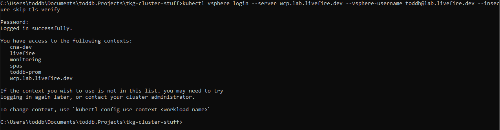

## SIMPLE tutorial on createing a TKG cluster on vSphere 7 ##

#### Step 1 ####

Log Into vsphere using kubectl vsphere plugin
```
kubectl vsphere login --server wcp.lab.livefire.dev --vsphere-username <user name> --insecure-skip-tls-verify
```
You will be asked to enter your password and then be shown he vSphere Workload Management Namespaces You have access to



#### Step 2 #### 

Switch vSphere with Tanzu Workload Managment Namespace 

```
kubectl config use-context <Workload Managment Namespace>
```
  kubectl config use-context <Workload Managment Namespace>

#### Step 3 #### 

Use kubectl apply -f with valid tkg yaml

``` 
kubectl apply -f <tkg.cluster.deployment.yaml>
```

Hellow World
